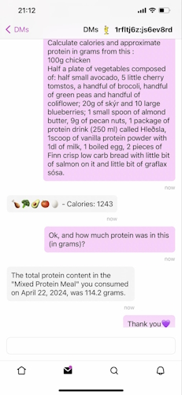

# Food Diary App

## Overview
The Food Diary App allows users to log their meals using natural language input and automatically estimates nutritional values like calories, fats, carbs, and proteins. The app supports queries about past meals and modifications to the diary entries.



### Features
- Log meals in natural language, e.g., "ate chicken 100g, with broccoli and cauliflower."
- Analyze nutritional content automatically.
- Understands multiple languages, mixed in same sentance
- Teach the app, "I'm female 45 years old", "I'm going low carb","bcf means burger with bacon and fries", "Ísey Skyr has 3.5gr carbs, 4gr fat, 9gr protein in 100gr, 170gr per serving"
- Query historical data, e.g., "What did I eat yesterday?" or "What is my carb intake today?"
- Update entries, e.g., "I had 2 sandwiches, not one."
- Remove the latest entry by simply saying it, 'remove my newest food entry'.
- Chat with a AI Nutritional specialist 
- App is running on your computer, that means
    - no external webservice (except AI to convert your message)
    - no ads
    - data is on your computer
    - privacy is yours, no company has your data
    - you can do what you like with your data

## Installation


> [!CAUTION]
> **Heads up: Using Food Diary app costs money**
> When you add an food diary entry, the app uses an Artificial Intelligence (AI) machine to analyse your message and break it down. This cost tiny bit of money, this can be from $0.001 - $0.01. It can even go higher, but usually not. Same applies when you ask questions or chat to the app. The app will guide you on how to buy credit.

1. Download [`FoodDiaryApp.zip`](https://raw.githubusercontent.com/ingig/FoodDiaryApp/main/FoodDiaryApp.zip) from this repository or clone the repository.
2. Ensure you have Plang installed on your system. If not, install it from [PLangHQ releases](https://github.com/PLangHQ/plang/releases).
3. Extract the downloaded zip file and navigate to the extracted directory.

## Usage
To run the app, open up your terminal/command in the directory FoodDiaryApp folder, and type in `plang` and press enter

```bash
plang
```

_If you have OpenAI API key, you can start with the command `plang --llmservice=openai`_


Once started, you can interact with the Food Diary App using a messaging apps [Amethyst (Android)](https://play.google.com/store/apps/details?id=com.vitorpamplona.amethyst&hl=en&gl=US) or [Damus (iPhone)](https://apps.apple.com/us/app/damus/id1628663131). Here’s how to get started:

- **Log an Entry:** Send a message detailing what you ate, e.g., "ate chicken 100g, with broccoli and cauliflower.
- **Add Knowledge:** Teach the your custom behavior, "eb means 1 egg and 3 bacon" allowing you to send short messages, if your message is "2 eb", app will know it's "2 eggs and 6 bacons"
- **Symptoms:** Add symptoms that you have after eating, collecting them and then later ask for relation between food and symptoms
- **Query Entries:** Ask questions like, "What did I eat yesterday?" or "How many carbs did I consume today?"
- **Correct Entries:** Send corrections as needed, e.g., "I had 2 sandwiches, not one."
- **Delete Entries:** To remove entries, send a message like "remove my last entry."

The app needs to be running for it to recieve a message from you and to respond. If the app is not running, it will process the message next time it will start. This means, you can at any time add an entry to your diary, even if app is not running.

## Customization

### Modifying System Setup
You can alter the app's behavior by modifying the `.txt` files located in the `llm` folders. Files that are named '*System' are the system definition for the AI. You can add things like 'User is woman aged 45', or 'Reply as sarcastic british comedian'. 

### Change the app code
Food diary app is written in [Plang](https://plang.is). Plang is a natural language programming language, this makes it easy to modify and easy to learn.

**Example**

To change the information sent by the messaging app, you might adjust the `Insert.goal` file. For instance, to switch from displaying calories to carbs in the app's messages:

Before:
```plang
- call goal SendMessage content=%foodEntry.emojis% - Calories: %foodEntry.dish.totalCalories%
```

After:
```plang
- call goal SendMessage content=%foodEntry.emojis% - Carbs: %foodEntry.dish.totalCarbs%
```

#### Rebuild the App
After making any changes to the `.goal` files, rebuild the application to apply the changes:
```bash
plang build
```
And restart your app.

## Learn Plang language
A good starting point is to checkout [plang.is](https://plang.is) website or by going to the [Get started guide](https://github.com/PLangHQ/plang/blob/main/Documentation/GetStarted.md)

## Support
For support, open an issue in this GitHub repository

## Contributing
Contributions are welcome! Please fork the repository and submit a pull request with your proposed changes.
